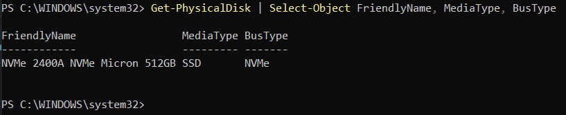
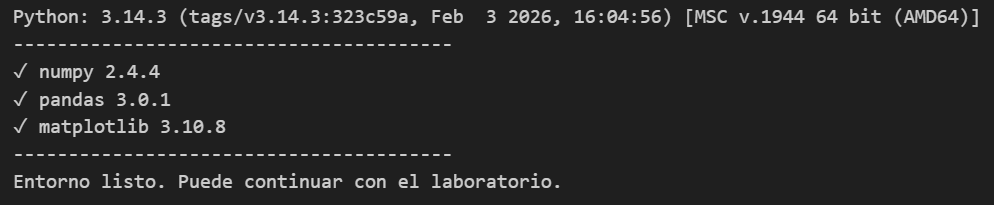
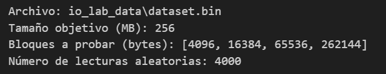
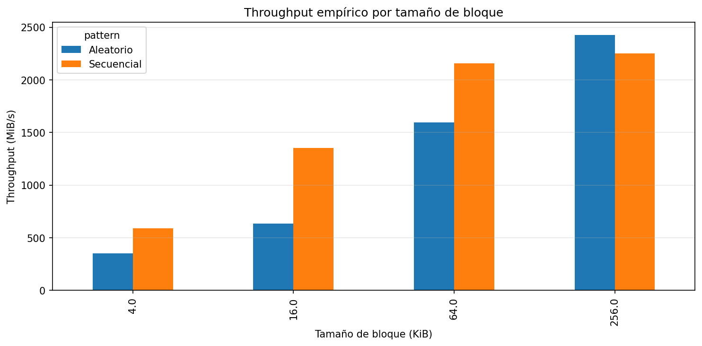
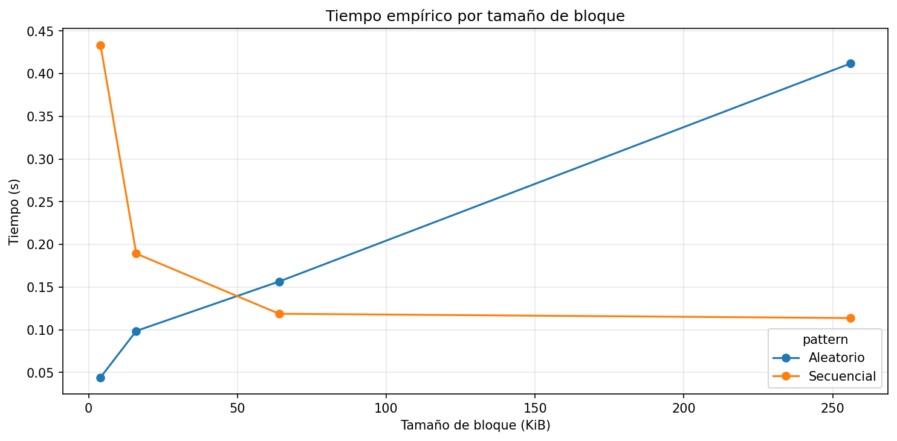
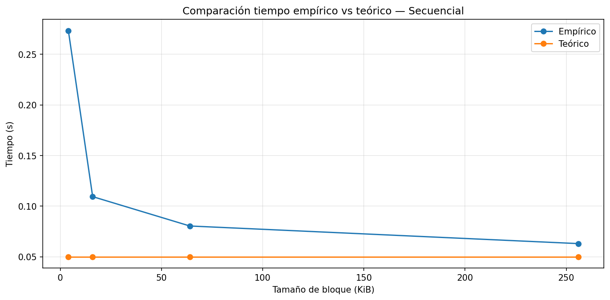
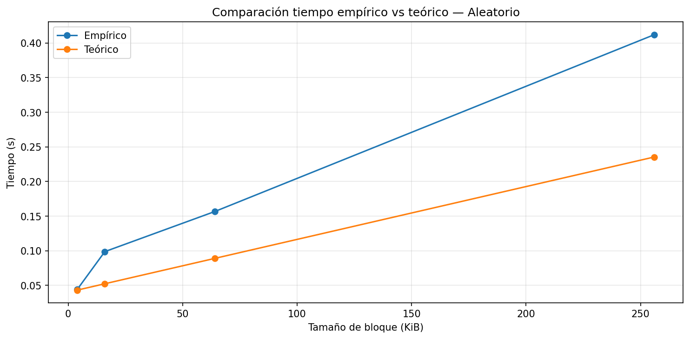
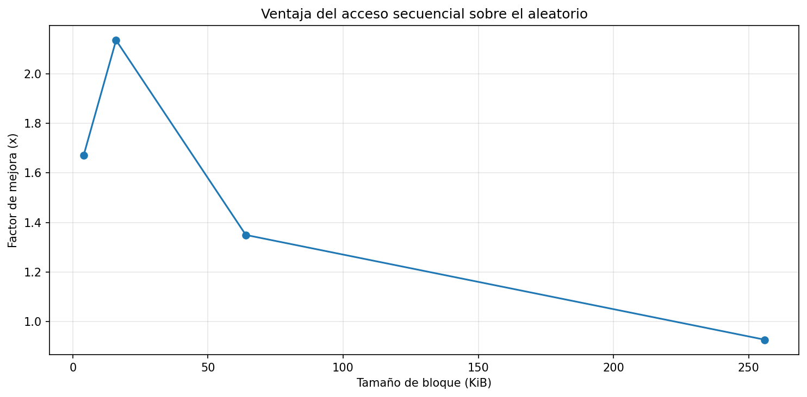

# laboratorio # 3 - IO performance
Laura KAtherine Areiza Henao - 1042150762

## Preparación del entorno experimental

### Identificación de la Tecnología de Almacenamiento

Para identificar el tipo de unidad física del sistema, se utilizó PowerShell en Windows ejecutado como administrador con el siguiente comando:

```
<Get-PhysicalDisk | Select-Object FriendlyName, MediaType, BusType>
```

A continuación, se muestra la evidencia del resultado:

<p style="text-align: center;">
  
</p>

De acuerdo con los valores obtenidos:

MediaType: SSD
BusType: NVMe

Esto indica que mi equipo cuenta con una unidad de estado sólido (SSD) que utiliza la tecnología NVMe.

### Registro de Especificaciones del Sistema

Antes de iniciar las pruebas, se registran las siguientes características del entorno de ejecución. Esta información permite contextualizar posibles variaciones en los tiempos de respuesta.

| Parámetro                 | Valor de Referencia |
|---------------------------|---------------------|
| Sistema Operativo         | Windows 11          |
| CPU (Modelo y Núcleos)    | 12th Gen Intel Core i5-1235U / 10 núcleos |
| Memoria RAM Total         | 8 GB                |
| Tipo de Disco             | SSD NVMe            |
| Carga de CPU en Reposo    | 4% - 11%            |


```
CPU : Get-CimInstance Win32_Processor | Select-Object Name, NumberOfCores

RAM : Get-CimInstance Win32_ComputerSystem | Select-Object TotalPhysicalMemory
```

<p style="text-align: center;">
  
</p>


Referencias de Rendimiento Teórico
Utilice estos valores como línea base para validar si sus resultados son coherentes con la teoría:

|Tecnología |Latencia Promedio|	Throughput Típico|IOPS Típico (4 KB aleatorio)|Escala de Tiempo|
|-----------|-----------------|------------------|----------------------------|----------------|
|HDD        |	10 ms	      |100 - 150 MB/s    |75 – 300	                  |Milisegundos    |
|SSD (SATA) |	100 µs        |	500 - 550 MB/s	 |50,000 – 100,000            |	Microsegundos  |
|SSD NVMe   |	10 - 20 µs    |	2 - 7 GB/s	     |500,000 – 1,000,000+        |	Microsegundos  |


> [!WARNING]
> **Preparación antes del benchmark:**
> 
> - Cerrar aplicaciones de alto consumo (navegadores, IDEs, etc.).
> - Verificar que no haya actualizaciones en segundo plano.
> - Evitar el uso de máquinas virtuales o contenedores.
> - Utilizar archivos grandes para evitar lecturas desde caché.
> - Realizar accesos dispersos para reducir la pre-lectura.
> - Ejecutar cada prueba de forma independiente.

## Actividad del laboratorio.

### Etapa 1

En esta etapa se registran las características del equipo utilizado para la ejecución del experimento. Esta información permite contextualizar los resultados obtenidos y entender posibles variaciones en el rendimiento.

| Parámetro                        | Valor Observado |
|----------------------------------|-----------------|
| Sistema Operativo                | Windows 11      |
| CPU (Modelo y Frecuencia)        | Intel Core i5-1235U |
| Arquitectura y Núcleos           | x64 / 10 núcleos |
| Memoria RAM Total                | 8 GB            |
| Tecnología de Almacenamiento     | SSD NVMe        |
| Carga de CPU en Reposo (%)       | < 10%           |

```
CPU en reposo : (Get-Counter '\Processor(_Total)\% Processor Time').CounterSamples.CookedValue
```

> [!NOTE]
> La carga de CPU fue medida en estado de reposo estable, después de unos segundos de haber abierto el Administrador de tareas, observando valores inferiores al 10%.

### Etapa 2

- [x] Realizar el portafolio remoto y copiarlo.
- [x] Descargar el archivo disk_io_lab_guided.ipynb y moverlo al 
- [x] Seguir las instrucciones del archivo.

#### Verificacion del entorno

Antes de iniciar el experimento, se verificó la correcta disponibilidad de las librerías necesarias para la ejecución del notebook.

<p align="center">  </p>

Esto asegura que todas las dependencias requeridas están correctamente instaladas y listas para su uso.

En el laboratorio, nos dedicaremos a analizar el rendimiento de las operaciones de entrada/salida (I/O) en disco. Medimos métricas como el tiempo de lectura, el throughput y una aproximación a la latencia, todo basado en datos empíricos que hemos recolectado a través de experimentos.

Evaluamos los patrones de acceso secuencial y aleatorio para comparar su desempeño y entender cómo factores como el tamaño de bloque influyen en la eficiencia de las lecturas.

También contrastamos nuestros hallazgos experimentales con el modelo teórico de costo de I/O, lo que nos permite ver las diferencias entre la teoría y la práctica, y así determinar qué tipo de acceso resulta ser el más eficiente.

A continuación, se muestra la configuración utilizada para la creación del archivo de prueba en el notebook:

<p align="center">
  
</p>

### Etapa 3

#### Diferencial de Desempeño

En los resultados que hemos obtenido, el acceso secuencial fue, en general, más eficiente que el acceso aleatorio. Esto se refleja en la gráfica de speedup, donde se puede observar una ventaja de aproximadamente 2.13 veces a favor del acceso secuencial en bloques de 16 KiB. Esta diferencia se produce porque el acceso secuencial permite leer datos de forma continua, lo que reduce la cantidad de accesos al disco y mejora el throughput.

No obstante, esta ventaja no es siempre la misma. En bloques más grandes, como los de 256 KiB, la diferencia se reduce notablemente, e incluso el acceso aleatorio puede ser ligeramente más rápido en algunos casos. Esto indica que, aunque el acceso secuencial suele ser más eficiente, el tamaño del bloque influye directamente en la magnitud de esta ventaja.

#### Efecto del Tamaño de Bloque

El tamaño del bloque tiene un impacto directo en cómo se desempeña el acceso aleatorio. Cuando el tamaño del bloque aumenta, el rendimiento también mejora notablemente, pasando de alrededor de 353 MiB/s en 4 KiB a cerca de 2427 MiB/s en 256 KiB.

Esto ocurre porque los bloques más grandes permiten transferir más datos en cada operación, lo que reduce la cantidad total de accesos necesarios. Dado que cada acceso conlleva un costo de latencia, al disminuir el número de accesos, ese costo se distribuye de manera más eficiente. Así, aumentar el tamaño del bloque ayuda a suavizar el efecto negativo del acceso aleatorio.

#### Correlación con la Teoría

Se pueden notar diferencias notables entre los valores teóricos y los empíricos, especialmente cuando se trata de acceso secuencial con bloques pequeños. Por ejemplo, al usar bloques de 4 KiB, el tiempo que se midió fue de aproximadamente 0.433 s, mientras que el modelo teórico anticipaba un valor mucho más bajo.

Estas discrepancias pueden atribuirse a factores físicos y del sistema que el modelo no tiene en cuenta, como la caché del sistema operativo, la gestión interna del SSD, la interfaz de conexión y la carga del sistema, incluso cuando el experimento se realiza en un entorno controlado como VS Code. Esto demuestra que, aunque el modelo teórico es una buena aproximación, no logra capturar del todo el comportamiento real del hardware.

#### Costo de Acceso

Aunque los SSD no tienen partes mecánicas como los discos duros tradicionales, el acceso aleatorio sigue siendo más costoso que el secuencial. Esto se debe a que, en el acceso aleatorio, el sistema tiene que manejar múltiples direcciones de memoria diferentes, lo que conlleva más operaciones internas de control y traducción.

Por otro lado, el acceso secuencial permite que los datos se lean de manera continua, aprovechando mejor la arquitectura del dispositivo y reduciendo la cantidad de operaciones necesarias. Por esta razón, incluso en los SSD más modernos, el acceso secuencial sigue siendo más eficiente en la mayoría de los casos.

#### Implicaciones en Sistemas

Si se estuviera diseñando un motor de base de datos, estos resultados indican que es fundamental organizar los datos de manera que se favorezcan los accesos secuenciales. Por ejemplo, se podrían almacenar los registros de forma contigua en disco o utilizar técnicas como lectura por bloques para reducir la cantidad de accesos aleatorios.

Además, se podrían implementar estructuras como índices para minimizar las búsquedas aleatorias y combinar esto con lecturas secuenciales cuando se necesite procesar grandes volúmenes de datos. En general, estos hallazgos muestran que el diseño del sistema debe buscar reducir la cantidad de accesos aleatorios y aprovechar al máximo el throughput del almacenamiento.

## Resultados del experimento

> [!NOTE]
> La gráfica de tiempo empírico fue generada correctamente y se incluye en este informe. Sin embargo, debido a un inconveniente durante la ejecución del notebook, dicha celda no quedó registrada en el archivo `.ipynb`. Esto no afecta el análisis, ya que la visualización y los datos correspondientes fueron obtenidos adecuadamente.


### Throughput vs tamaño de bloque



### Tiempo empírico



### Tiempo teoría vs práctica (secuencial)



### Tiempo teoría vs práctica (aleatorio)



### Speedup



