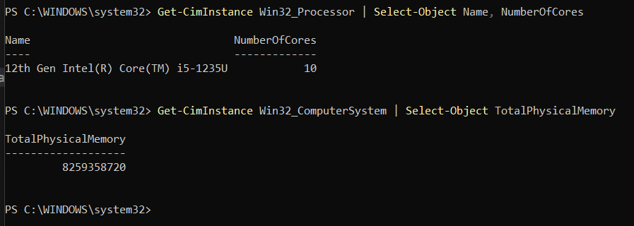

# laboratorio # 3 - IO performance
Laura KAtherine Areiza Henao - 1042150762

## Identificación de la Tecnología de Almacenamiento

Para identificar el tipo de unidad física del sistema, se utilizó PowerShell en Windows ejecutado como administrador con el siguiente comando:

```
<Get-PhysicalDisk | Select-Object FriendlyName, MediaType, BusType>
```

A continuación, se muestra la evidencia del resultado:

<p style="text-align: center;">
  
</p>

De acuerdo con los valores obtenidos:

MediaType: SSD
BusType: NVMe

Esto indica que mi equipo cuenta con una unidad de estado sólido (SSD) que utiliza la tecnología NVMe.

## Registro de Especificaciones del Sistema

Antes de iniciar las pruebas, se registran las siguientes características del entorno de ejecución. Esta información permite contextualizar posibles variaciones en los tiempos de respuesta.

| Parámetro                 | Valor de Referencia |
|---------------------------|---------------------|
| Sistema Operativo         | Windows 11          |
| CPU (Modelo y Núcleos)    | 12th Gen Intel Core i5-1235U / 10 núcleos |
| Memoria RAM Total         | 8 GB                |
| Tipo de Disco             | SSD NVMe            |
| Carga de CPU en Reposo    | 4% - 11%            |


```
CPU : Get-CimInstance Win32_Processor | Select-Object Name, NumberOfCores

RAM : Get-CimInstance Win32_ComputerSystem | Select-Object TotalPhysicalMemory

```

<p style="text-align: center;">
  
</p>


Referencias de Rendimiento Teórico
Utilice estos valores como línea base para validar si sus resultados son coherentes con la teoría:

|Tecnología |Latencia Promedio|	Throughput Típico|IOPS Típico (4 KB aleatorio)|Escala de Tiempo|
|-----------|-----------------|------------------|----------------------------|----------------|
|HDD        |	10 ms	      |100 - 150 MB/s    |75 – 300	                  |Milisegundos    |
|SSD (SATA) |	100 µs        |	500 - 550 MB/s	 |50,000 – 100,000            |	Microsegundos  |
|SSD NVMe   |	10 - 20 µs    |	2 - 7 GB/s	     |500,000 – 1,000,000+        |	Microsegundos  |


> [!WARNING]
> **Preparación antes del benchmark:**
> 
> - Cerrar aplicaciones de alto consumo (navegadores, IDEs, etc.).
> - Verificar que no haya actualizaciones en segundo plano.
> - Evitar el uso de máquinas virtuales o contenedores.
> - Utilizar archivos grandes para evitar lecturas desde caché.
> - Realizar accesos dispersos para reducir la pre-lectura.
> - Ejecutar cada prueba de forma independiente.


